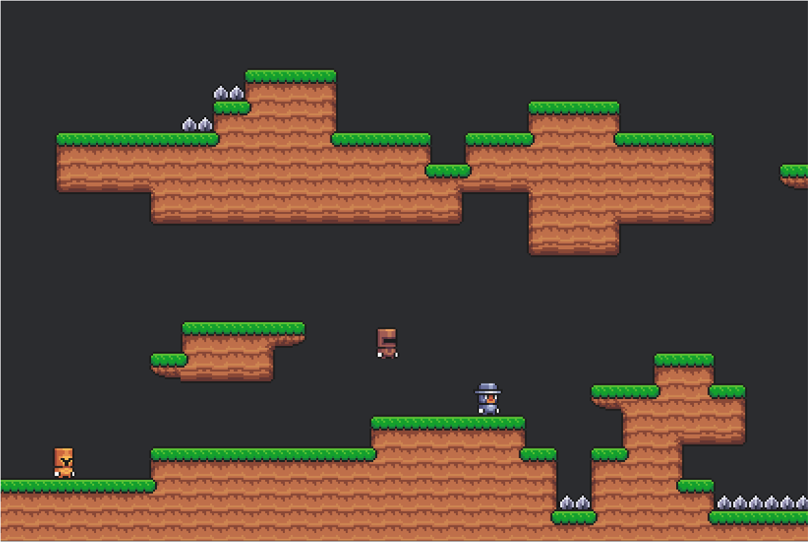

# Rust JumpNRun
This is a multiplayer Jump 'n' Run game build using Rust and the [Bevy GameEngine](https://bevyengine.org).
The repo contains of the game aswell as the server managing the multiplayer.



## Run the project locally

Requirements:
* Clone of this project on your machine
* Up to date Rust installation
* Up to date Docker installation

Dependecies like the bevy game engine will be downloaded automatically on first run.

#### 1. Run the server
Go to the root directory of this project and run the following command:
``` bash
docker compose up --build
```
This will build the the docker container and start the game server. You should now see `rust_jumpnrun` in docker desktop or using `docker ps`.

#### 2. Run the game
You first have to switch to the game directoy inside of the project. Then you can run the game:
``` bash
cd game
cargo run
```
Keep in mind that this is the debug version and things are way slower than in the release version. To run in release version use `cargo run --release`.
It is normal to take long when building the first time, just keep calm and get something to drink while waiting :)
